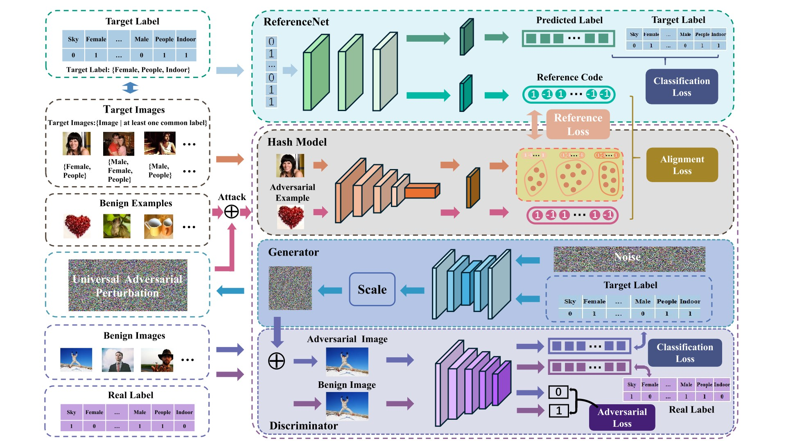

# TUA: Targeted Universal Adversarial Attack on Deep Hash Networks

This repository contains the implementation of our ICMR 2024 paper, **"Targeted Universal Adversarial Attack on Deep Hash Networks"**.

## Overview

Our TUA framework is depicted below: 

## Requirements

To run this project, you'll need the following dependencies:

* python 3.10.14 
* pytorch 2.2.0
* torchvision 0.17.0 

You can download the MIR-FLICKR, NUS-WIDE, and MS-COCO datasets following the instructions in [this repository](https://github.com/swuxyj/DeepHash-pytorch).

## Usage

Before you start, make sure to check and modify the training parameters as necessary in the *configs* folder.

### Training the Deep Hash Model

To train the deep hash model, run the following command:

``` shell
 python train_hash.py
```

### Attacking the Target Deep Hash Model

To perform the adversarial attack on the target deep hash model, use the following command:

``` shell
python train_attack.py
```

